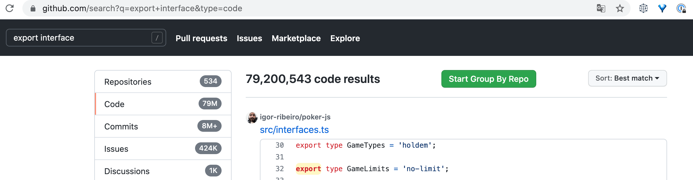
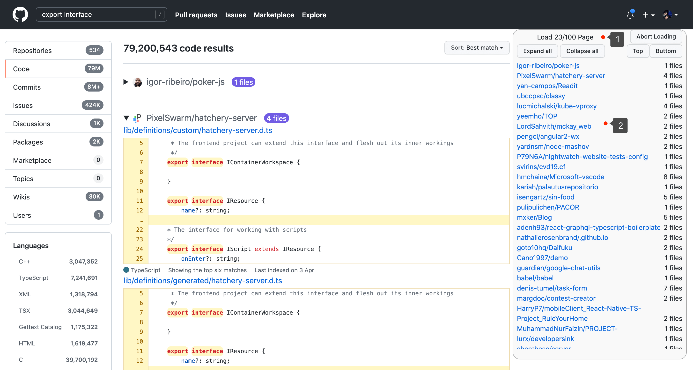

# group-by-repo-on-github
This is the script of tampermonkey. Before using it, please make sure you have <a href="https://www.tampermonkey.net/" target="_blank">installed</a>

When you search code using github, this script can help you group by repo

## Install
Click the <a href="https://github.com/foamzou/group-by-repo-on-github/raw/main/index.user.js" target="_blank">link</a> to install

## Feature
- The script will create a button in the page, will group by repo for the search result when you click the button

- The new page like this
    - Label 1: When the search results are paged, the page will be automatically fetched and updated to the current page in real time. If you do not want to continue loading new content, you can click the abort button at any time to terminate the fetch
    - Label 2: The directory page of the repo, you can click on the repo and it will jump to the anchor point
    - In addition, support to collapse/expand all repo, jump to the top/bottom
